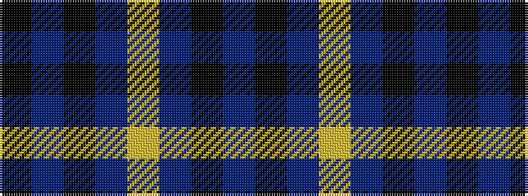

BKBYBKBK

It is a 8 stripe tartan.

<figure class="pat-woven">

<figcaption>idealised sample</figcaption>
</figure>

## Colour Sequence



## Tartans with this colour sequence

| Tartans |
|---------------|
| [South African Air Force](/variants/s8/n15k14t1ly2t1k14n15k2~x4/)|
||
