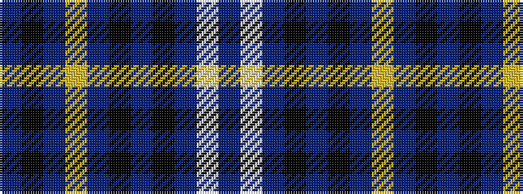

BKBYBKBKBWB

It is a 11 stripe tartan.

<figure class="pat-woven">

<figcaption>idealised sample</figcaption>
</figure>

## Colour Sequence



## Tartans with this colour sequence

| Tartans |
|---------------|
| [Bute Heather, Ancient](/setts/s11/db6w1t18k6t4k4p8lg1p8k2db5~x2/)|
||
