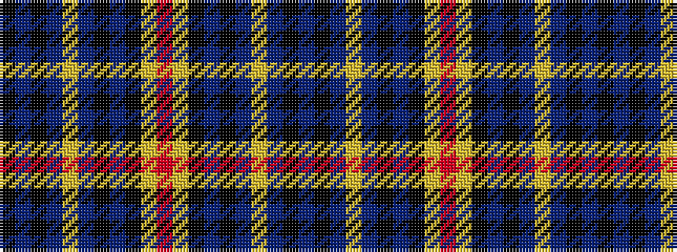

BKBYBKBKYRYKBKBYBKBK

It is a 20 stripe tartan.

<figure class="pat-woven">

<figcaption>idealised sample</figcaption>
</figure>

## Colour Sequence



## Tartans with this colour sequence

| Tartans |
|---------------|
| [City of Rome Italian Corporate Tartan](/variants/s20/k88db45k6db6ly6db6k6db45k88lo6r12/)|
||
