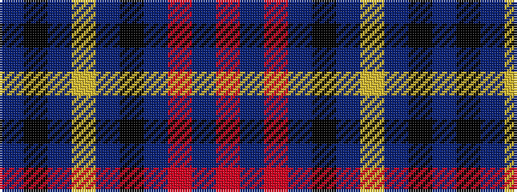

BKBYBKBRBR

It is a 10 stripe tartan.

<figure class="pat-woven">

<figcaption>idealised sample</figcaption>
</figure>

## Colour Sequence



## Tartans with this colour sequence

| Tartans |
|---------------|
| [D'Souza (Personal)](/variants/s10/dp24k2dp2lo2dp2k20db16o2db2o3~x2/)|
||
