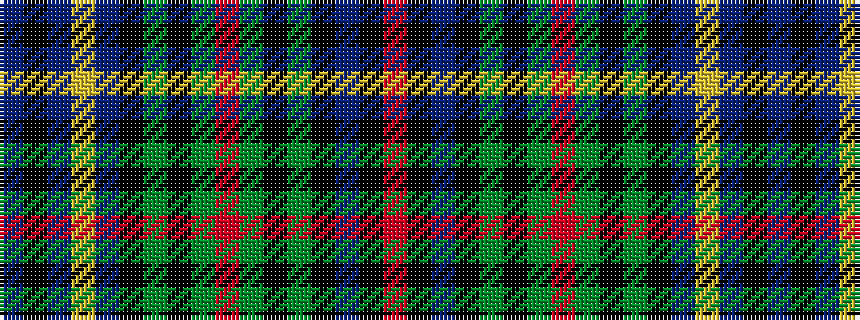

BKBYBKGKGRGKGKBKR

It is a 17 stripe tartan.

<figure class="pat-woven">

<figcaption>idealised sample</figcaption>
</figure>

## Colour Sequence



## Tartans with this colour sequence

| Tartans |
|---------------|
| [Murray, Tony (Personal)](/setts/s17/b15k2b2ly2b2k10g10k1g2r2g2k1g10k10b10k1r2~x2/)|
||
