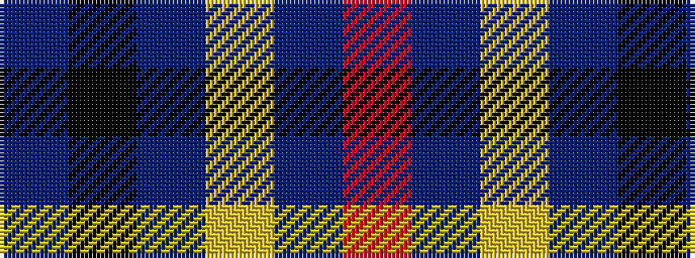

BKBYBR

It is a 6 stripe tartan.

<figure class="pat-woven">

<figcaption>idealised sample</figcaption>
</figure>

## Colour Sequence



## Tartans with this colour sequence

| Tartans |
|---------------|
| [Norsemen (Corporate)](/setts/s6/n65k2n4lr2n10r24~x2/)|
||
