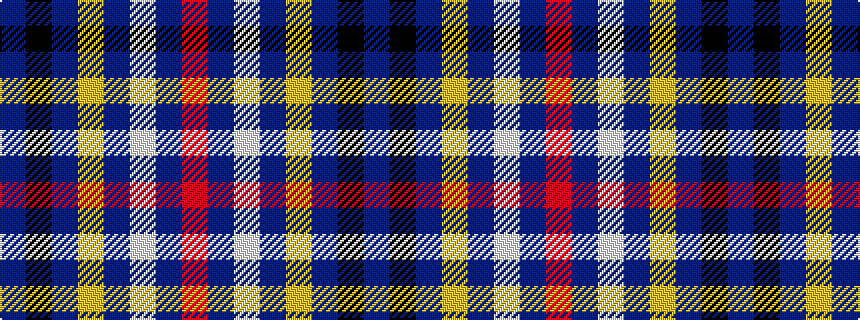

BKBYBWBR

It is a 8 stripe tartan.

<figure class="pat-woven">

<figcaption>idealised sample</figcaption>
</figure>

## Colour Sequence



## Tartans with this colour sequence

| Tartans |
|---------------|
| [Maud, Mary](/variants/s8/db65k9db21ly8db21w8db35r35/)|
||
| [Maud, Mary](/variants/s8/b130k9b21ly8b21w8b35r70/)|
||
