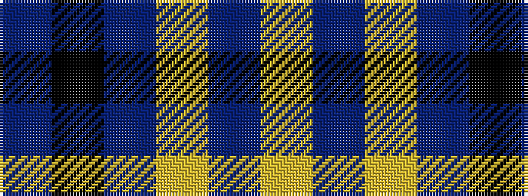

BKBYBY

It is a 6 stripe tartan.

<figure class="pat-woven">

<figcaption>idealised sample</figcaption>
</figure>

## Colour Sequence



## Tartans with this colour sequence

| Tartans |
|---------------|
| [British Energy](/setts/s6/db52k12dp18ly1dp1ly4~x2/)|
||
| [British Energy](/setts/s6/b40k14p22ly1p1ly3~x2/)|
||
