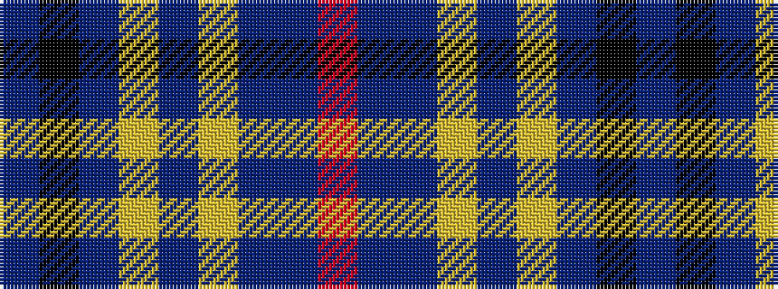

BKBYBYBBR

It is a 9 stripe tartan.

<figure class="pat-woven">

<figcaption>idealised sample</figcaption>
</figure>

## Colour Sequence



## Tartans with this colour sequence

| Tartans |
|---------------|
| [Gedling, Peter (Personal)](/setts/s9/r8db9dp3ly1dp1ly2dp2k32dp1~x2/)|
||
