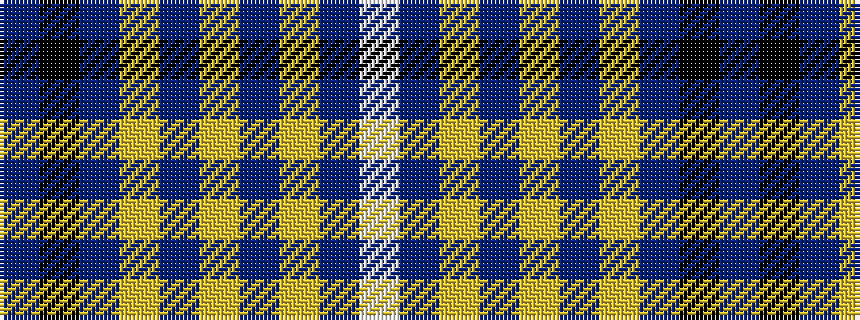

BKBYBYBYBW

It is a 10 stripe tartan.

<figure class="pat-woven">

<figcaption>idealised sample</figcaption>
</figure>

## Colour Sequence



## Tartans with this colour sequence

| Tartans |
|---------------|
| [Digital Corporate Tartan](/variants/s10/t6k3t10lo5t2lo2t2lo2t7w2~x2/)|
||
