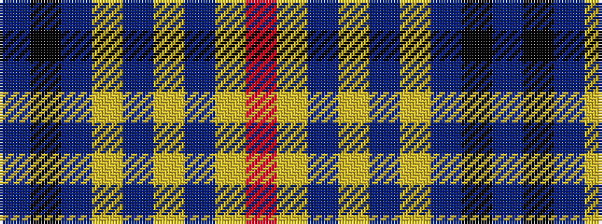

BKBYBYBYR

It is a 9 stripe tartan.

<figure class="pat-woven">

<figcaption>idealised sample</figcaption>
</figure>

## Colour Sequence



## Tartans with this colour sequence

| Tartans |
|---------------|
| [Gedling, Peter (Personal)](/variants/s9/r8lg9dp3ly1dp1ly2dp2k32dp3~x2/)|
||
