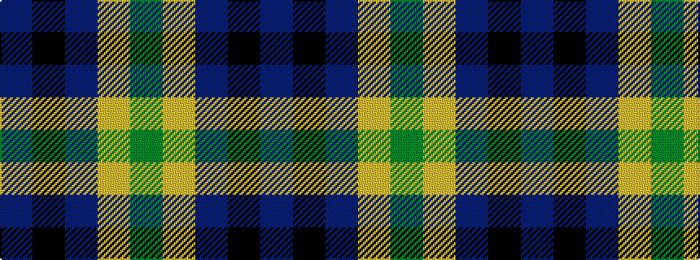

BKBYG

It is a 5 stripe tartan.

<figure class="pat-woven">

<figcaption>idealised sample</figcaption>
</figure>

## Colour Sequence



## Tartans with this colour sequence

| Tartans |
|---------------|
| [Rowan (Personal)](/variants/s5/g12lo1db8k1db1~x4/)|
||
