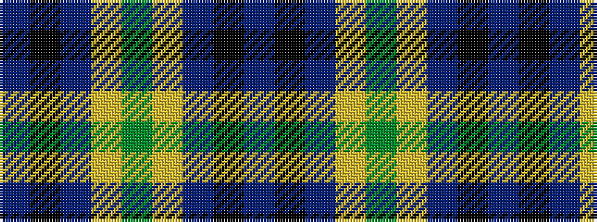

BKBYGYBKB

It is a 9 stripe tartan.

<figure class="pat-woven">

<figcaption>idealised sample</figcaption>
</figure>

## Colour Sequence



## Tartans with this colour sequence

| Tartans |
|---------------|
| [Rowan](/setts/s9/db1k1db8ly1g12ly1db8k1db1~x2/)|
||
