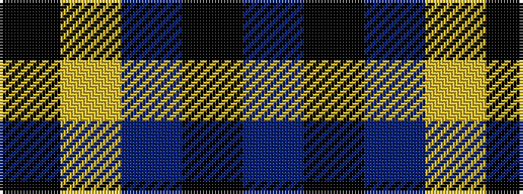

BKBYK

It is a 5 stripe tartan.

<figure class="pat-woven">

<figcaption>idealised sample</figcaption>
</figure>

## Colour Sequence



## Tartans with this colour sequence

| Tartans |
|---------------|
| [Jahore](/variants/s5/db20k5db18ly26k6~x2/)|
||
| [Johore Regiment (Military)](/variants/s5/db20k5db18lo26k6~x2/)|
||
