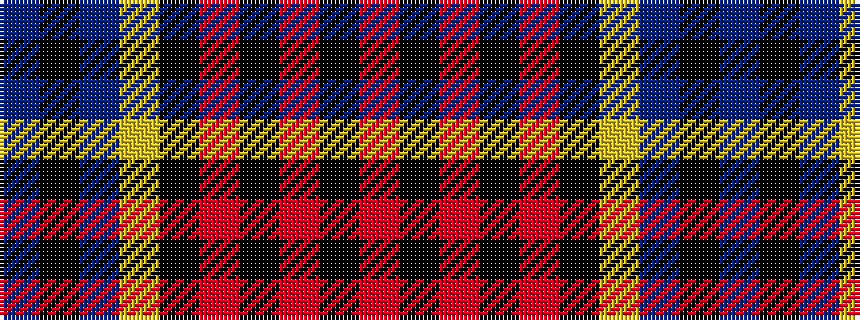

BKBYKRKRKR

It is a 10 stripe tartan.

<figure class="pat-woven">

<figcaption>idealised sample</figcaption>
</figure>

## Colour Sequence



## Tartans with this colour sequence

| Tartans |
|---------------|
| [St George's School](/variants/s10/r10k4r4k6r28k10lo4db30k4db7~x2/)|
||
| [St. George's (Edinburgh) (School)](/variants/s10/r7k3r4k5r25k7ly2db22k3db4~x2/)|
||
