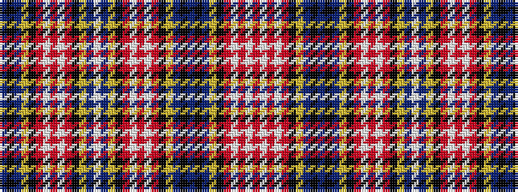

BKBYKRWRWRKYBWBYKRWRWRKYBKBKBYKRWRWR

It is a 36 stripe tartan.

<figure class="pat-woven">

<figcaption>idealised sample</figcaption>
</figure>

## Colour Sequence



## Tartans with this colour sequence

| Tartans |
|---------------|
| [Ogilvy](/setts/s36/db5k1db5ly2k1r3w1r3w1r3k1ly1db3w1db3ly1k1r3w1r3w1r3k1ly1db5k1db5k1db5ly1k1r3w1r3w1r3~x4/)|
||
