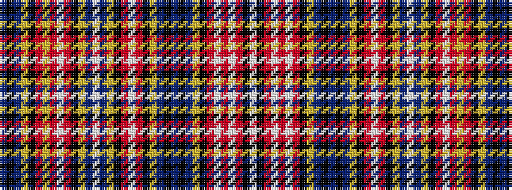

BKBYKRYRWRKYBWBYKRWRKYBKBKBYKRWRWRKW

It is a 36 stripe tartan.

<figure class="pat-woven">

<figcaption>idealised sample</figcaption>
</figure>

## Colour Sequence



## Tartans with this colour sequence

| Tartans |
|---------------|
| [Ogilvie (Paton)](/setts/s36/db6k2db6ly4k2r3ly2r3w2r3k2ly2db3w2db3ly2k2r3w2r3k2ly2db6k2db6k2db6ly2k2r3w2r3w2r3k6w1~x2/)|
||
