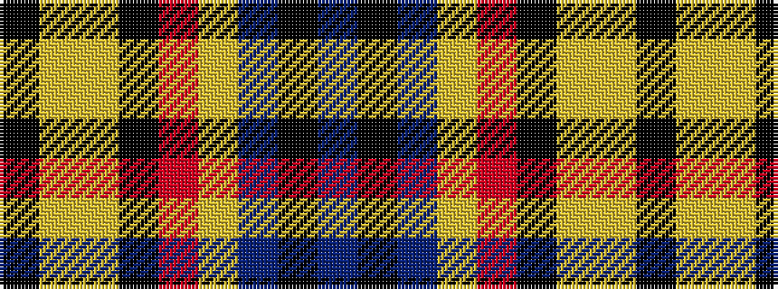

BKBYRKYYK

It is a 9 stripe tartan.

<figure class="pat-woven">

<figcaption>idealised sample</figcaption>
</figure>

## Colour Sequence



## Tartans with this colour sequence

| Tartans |
|---------------|
| [McGurk (Personal)](/variants/s9/db8k4db31lo5r26k5ly10lo5k2/)|
||
