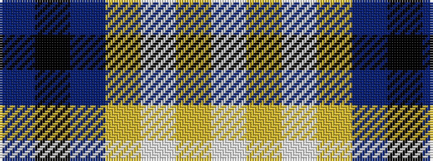

BKBYWYW

It is a 7 stripe tartan.

<figure class="pat-woven">

<figcaption>idealised sample</figcaption>
</figure>

## Colour Sequence



## Tartans with this colour sequence

| Tartans |
|---------------|
| [Tilburg Hunting (District)](/setts/s7/b6k3b37ly41w3ly6w3~x2/)|
||
