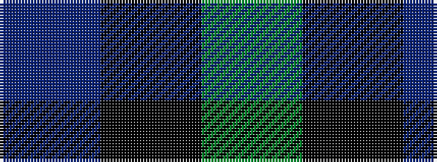

BKG

It is a 3 stripe tartan.

<figure class="pat-woven">

<figcaption>idealised sample</figcaption>
</figure>

## Colour Sequence



## Tartans with this colour sequence

| Tartans |
|---------------|
| [Glenlyon #2](/setts/s3/g3k2db2~x4/)|
||
| [Wilson's No.052](/setts/s3/g7k4t4~x2/)|
||
| [Wilson's, No 50](/setts/s3/g5k6t1~x4/)|
||
