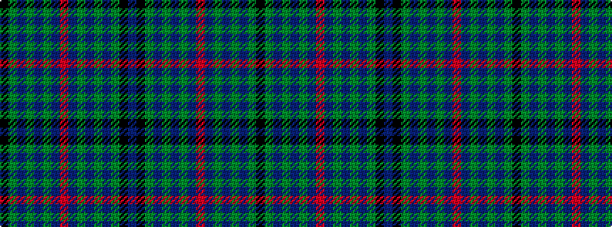

BKGBGBGBRBGBGBGK

It is a 16 stripe tartan.

<figure class="pat-woven">

<figcaption>idealised sample</figcaption>
</figure>

## Colour Sequence



## Tartans with this colour sequence

| Tartans |
|---------------|
| [Orlando, City of](/variants/s16/db12k1g16db1g1db14g3db14r2~x4/)|
||
