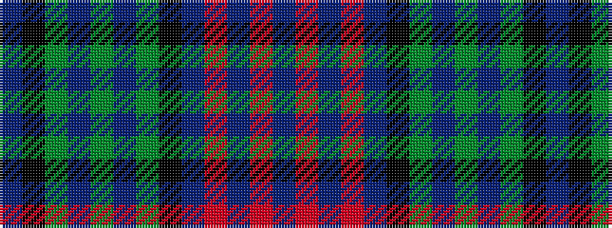

BKGBGBGKBRBRB

It is a 13 stripe tartan.

<figure class="pat-woven">

<figcaption>idealised sample</figcaption>
</figure>

## Colour Sequence



## Tartans with this colour sequence

| Tartans |
|---------------|
| [MacTaggert Clan Tartan](/variants/s13/db9k12g2t4g18t4g2k12db12r2db2r2db3~x2/)|
||
