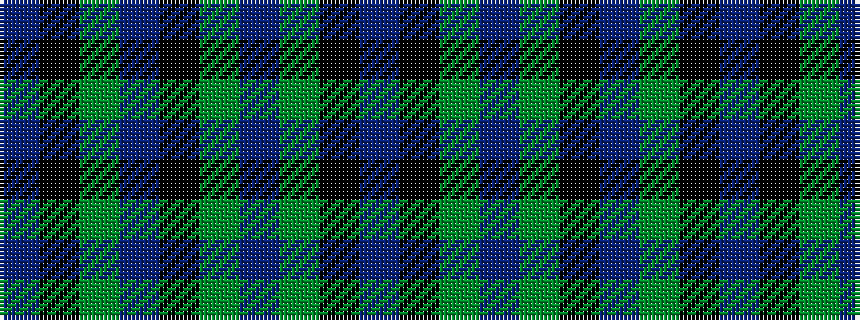

BKGBGKBGKB

It is a 10 stripe tartan.

<figure class="pat-woven">

<figcaption>idealised sample</figcaption>
</figure>

## Colour Sequence



## Tartans with this colour sequence

| Tartans |
|---------------|
| [Chateau](/variants/s10/n36k3dy3t1dy3k3n4dy6k1t2~x4/)|
||
