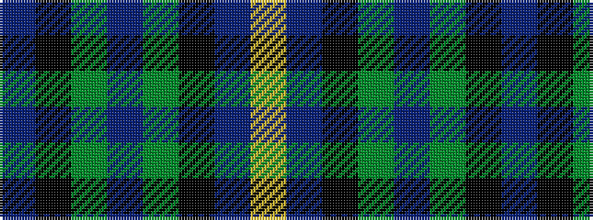

BKGBGKBY

It is a 8 stripe tartan.

<figure class="pat-woven">

<figcaption>idealised sample</figcaption>
</figure>

## Colour Sequence



## Tartans with this colour sequence

| Tartans |
|---------------|
| [Linden Family Tartan Tartan Number: 5772. Earliest known date: Jan 2003 Blue and white from the saltire. Purple and green from the thistle. The name Linden is associated with the colour green. The Linden tree is a lime tree. See products available Copyright © Blair Urquhart, Comrie, 2015](/setts/s8/dt4k9dgi20dp2dg20k5dt6lr2~x2/)|
||
