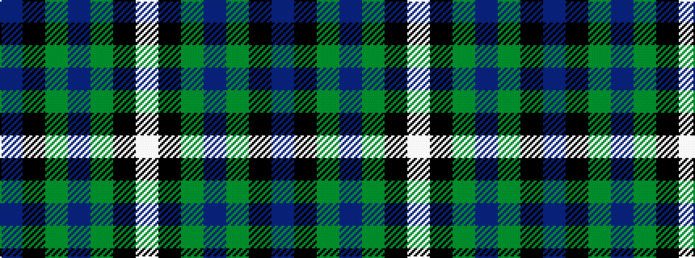

BKGBGKW

It is a 7 stripe tartan.

<figure class="pat-woven">

<figcaption>idealised sample</figcaption>
</figure>

## Colour Sequence



## Tartans with this colour sequence

| Tartans |
|---------------|
| [Alexander](/variants/s7/db24k8g8dp2g8k1w2~x2/)|
||
| [Alexander - 2000 (Name)](/variants/s7/db12k4g4dp1g4k1w1~x4/)|
||
