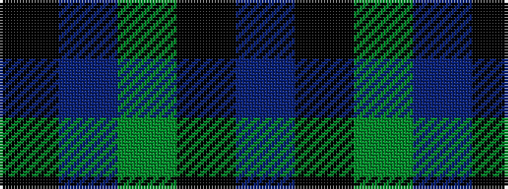

BKGBK

It is a 5 stripe tartan.

<figure class="pat-woven">

<figcaption>idealised sample</figcaption>
</figure>

## Colour Sequence



## Tartans with this colour sequence

| Tartans |
|---------------|
| [Wandering Shepherd (Personal)](/setts/s5/db2k2g2db1k1~x20/)|
||
