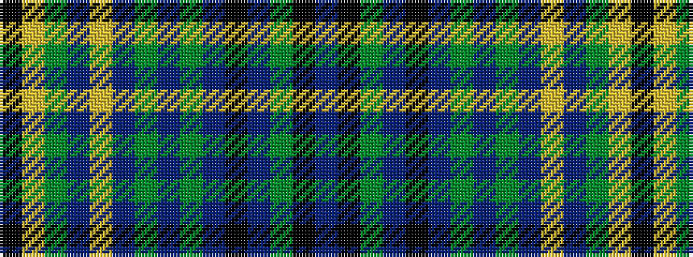

BKGBKBGBGBYBGYK

It is a 15 stripe tartan.

<figure class="pat-woven">

<figcaption>idealised sample</figcaption>
</figure>

## Colour Sequence



## Tartans with this colour sequence

| Tartans |
|---------------|
| [Benyon of Wales](/variants/s15/db22k1dg3db6k1db6dg3db4dg7db11ly1db11dg7ly2k6/)|
||
| [Benyon of Wales (Name)](/variants/s15/db22k1dg3db6k1db6dg3db4dg7db11ly1db11dg7ly2k4~x2/)|
||
| [Beynon](/variants/s15/db11k1dg3db6k1db6dg3db4dg7db11ly1db11dg7ly2k4/)|
||
