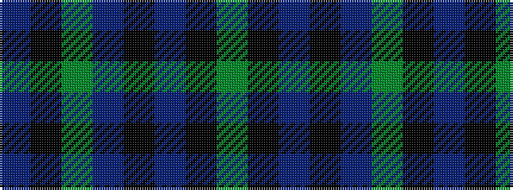

BKGBKBKG

It is a 8 stripe tartan.

<figure class="pat-woven">

<figcaption>idealised sample</figcaption>
</figure>

## Colour Sequence



## Tartans with this colour sequence

| Tartans |
|---------------|
| [Letham (S.Australia)](/setts/s8/g40k20t10k4t7g13k4t4~x2/)|
||
| [Letham Personal Tartan Tartan Number: 6718. Earliest known date: pre 2005 Jimmy said, in his recording application, "To allow my family to wear a single tartan" See products available Copyright © Blair Urquhart, Comrie, 2015](/setts/s8/g40k20db10k4db7g13k4db4~x2/)|
||
