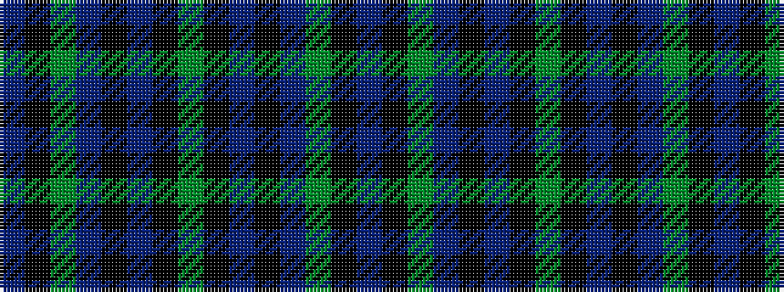

BKGBKBKGKBKBGKB

It is a 15 stripe tartan.

<figure class="pat-woven">

<figcaption>idealised sample</figcaption>
</figure>

## Colour Sequence



## Tartans with this colour sequence

| Tartans |
|---------------|
| [Letham Hunting (Name)](/setts/s15/dp2k2g6t4k2db5k4g20k4t5k2t4g6k2dp2~x2/)|
||
