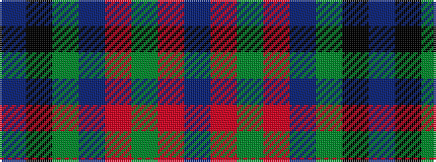

BKGBRGRB

It is a 8 stripe tartan.

<figure class="pat-woven">

<figcaption>idealised sample</figcaption>
</figure>

## Colour Sequence



## Tartans with this colour sequence

| Tartans |
|---------------|
| [Shaw of Tordarroch Green (Htg) (Clan](/setts/s8/t5k1g30db15r8g30r8db2~x2/)|
||
| [Shaw of Tordarroch Hunting Clan Tartan Tartan Number: 318. Earliest known date: 1969 Also known as 'Green Shaw of Tordarroch'. Green is 'Sage Green' Proportionally reduced for display. (50%) See products available Copyright © Blair Urquhart, Comrie, 2015](/setts/s8/t5k1y30dp15r8y30r8dp2/)|
||
| [Shaw of Tordarroch, hunting](/setts/s8/t5k1y30p15r8y30r8p2~x2/)|
||
