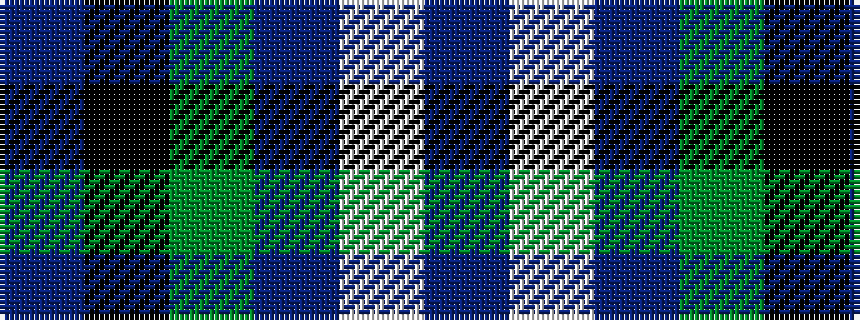

BKGBWB

It is a 6 stripe tartan.

<figure class="pat-woven">

<figcaption>idealised sample</figcaption>
</figure>

## Colour Sequence



## Tartans with this colour sequence

| Tartans |
|---------------|
| [Riley's Theme (Fashion)](/setts/s6/db20k4g5dp14w1db2~x2/)|
||
