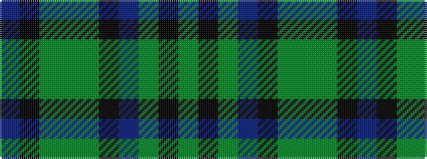

BKGGGKBGKG

It is a 10 stripe tartan.

<figure class="pat-woven">

<figcaption>idealised sample</figcaption>
</figure>

## Colour Sequence



## Tartans with this colour sequence

| Tartans |
|---------------|
| [Verdon](/variants/s10/dt36k3dg3g1dg3k3dt4dg6k1g2~x4/)|
||
