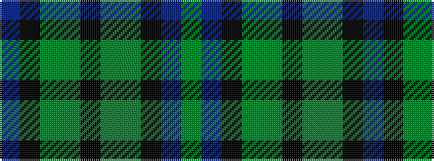

BKGGKGGKBG

It is a 10 stripe tartan.

<figure class="pat-woven">

<figcaption>idealised sample</figcaption>
</figure>

## Colour Sequence



## Tartans with this colour sequence

| Tartans |
|---------------|
| [Wilson's No.231](/setts/s10/dp8k9y2dg10k2dg10y2k9dp8dg2~x2/)|
||
