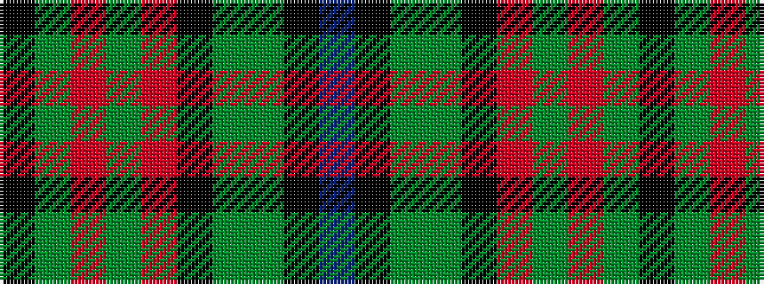

BKGGKRGRGK

It is a 10 stripe tartan.

<figure class="pat-woven">

<figcaption>idealised sample</figcaption>
</figure>

## Colour Sequence



## Tartans with this colour sequence

| Tartans |
|---------------|
| [Dutch Friendship](/setts/s10/k3dy14o4dy9o14k14y14y14k1n3~x2/)|
||
| [Dutch Friendship (Fashion)](/setts/s10/k3dy14o4dy9o14k14y14yi14k1n3~x2/)|
||
