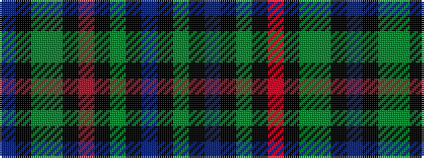

BKGGKRKGKBKG

It is a 12 stripe tartan.

<figure class="pat-woven">

<figcaption>idealised sample</figcaption>
</figure>

## Colour Sequence



## Tartans with this colour sequence

| Tartans |
|---------------|
| [Tomatin Distillery](/variants/s12/do9k8y15dy50k3r2k2dg1k2do1k1dy9~x2/)|
||
