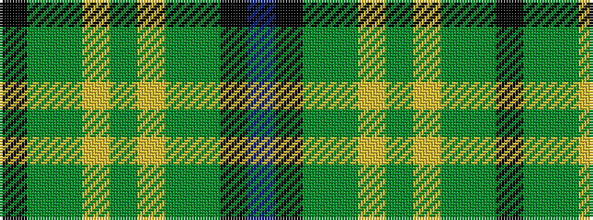

BKGGYGYGGK

It is a 10 stripe tartan.

<figure class="pat-woven">

<figcaption>idealised sample</figcaption>
</figure>

## Colour Sequence



## Tartans with this colour sequence

| Tartans |
|---------------|
| [U.S. Army](/variants/s10/k17y4gi51ly3g4ly3gi51y4k17db6~x2/)|
||
