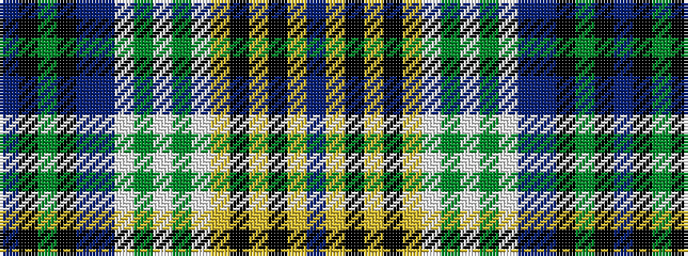

BKGKBBWGWGWYKYKYB

It is a 17 stripe tartan.

<figure class="pat-woven">

<figcaption>idealised sample</figcaption>
</figure>

## Colour Sequence



## Tartans with this colour sequence

| Tartans |
|---------------|
| [Bog Myrtle Corner](/setts/s17/db28ly6k2ly1k2ly6w6dg2w1dg2w6db28n4k5dg8k5n4~x2/)|
||
