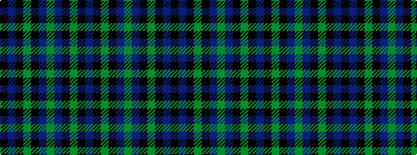

BKGKBGBKGKBK

It is a 12 stripe tartan.

<figure class="pat-woven">

<figcaption>idealised sample</figcaption>
</figure>

## Colour Sequence



## Tartans with this colour sequence

| Tartans |
|---------------|
| [Marchmont (Personal)](/variants/s12/db12k12g1k12db12g1db12k12g1k12db12k1~x4/)|
||
