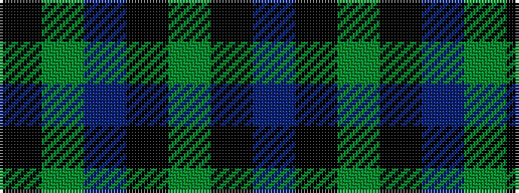

BKGKBGK

It is a 7 stripe tartan.

<figure class="pat-woven">

<figcaption>idealised sample</figcaption>
</figure>

## Colour Sequence



## Tartans with this colour sequence

| Tartans |
|---------------|
| [Outdoorsmen (Fashion)](/setts/s7/b3k1g4k1b4g9k2~x4/)|
||
