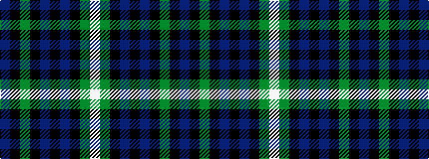

BKGKBKBKGW

It is a 10 stripe tartan.

<figure class="pat-woven">

<figcaption>idealised sample</figcaption>
</figure>

## Colour Sequence



## Tartans with this colour sequence

| Tartans |
|---------------|
| [Pitceathly Chamberlain (Personal)](/variants/s10/db2k3g5k9db21k2db5k2g20w1~x2/)|
||
| [Pitceathly Chamberlain Tartan](/variants/s10/db2k3dg5k7db20k2db5k2dg20lb1~x2/)|
||
