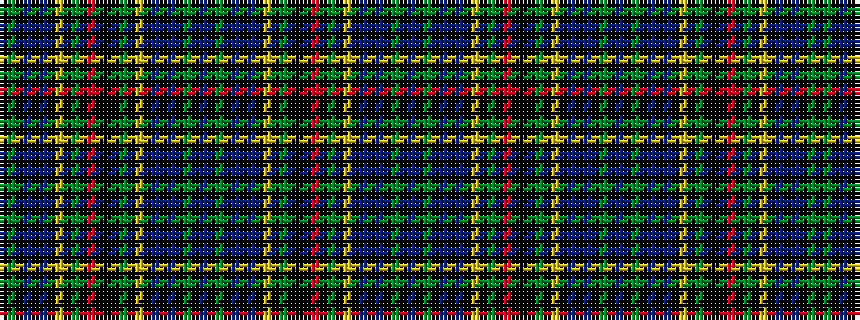

BKGKBKBKYKGKRKKKGKYKBKBKGKBKGKBKBKYKGKKKRKGKYKBKBKGK

It is a 52 stripe tartan.

<figure class="pat-woven">

<figcaption>idealised sample</figcaption>
</figure>

## Colour Sequence



## Tartans with this colour sequence

| Tartans |
|---------------|
| [MacKay, of Strathnaver](/setts/s52/n18k1dg18k1n18k1dr18k1lo18k1dy18k1k18k1o18k1dy18k1lo18k1dr18k1n18k1dg18k1n18~x2/)|
||
