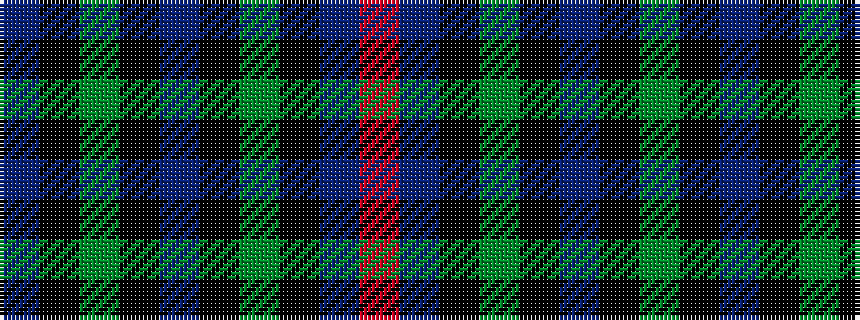

BKGKBKGKBR

It is a 10 stripe tartan.

<figure class="pat-woven">

<figcaption>idealised sample</figcaption>
</figure>

## Colour Sequence



## Tartans with this colour sequence

| Tartans |
|---------------|
| [Wcwm 1684-2](/variants/s10/p48k10dy12k2p3k2dy12k10p2o3~x2/)|
||
