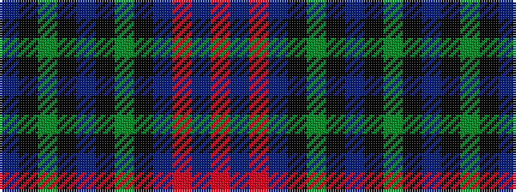

BKGKBKGKBRBR

It is a 12 stripe tartan.

<figure class="pat-woven">

<figcaption>idealised sample</figcaption>
</figure>

## Colour Sequence



## Tartans with this colour sequence

| Tartans |
|---------------|
| [Trinity Presbyterian Church](/setts/s12/r3t3r3t12k6g3k4db16k4g3k6t3~x2/)|
||
