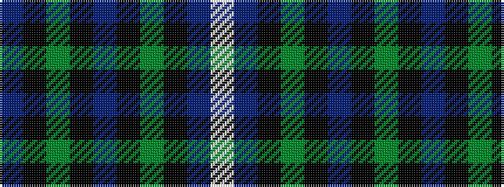

BKGKBKGKBW

It is a 10 stripe tartan.

<figure class="pat-woven">

<figcaption>idealised sample</figcaption>
</figure>

## Colour Sequence



## Tartans with this colour sequence

| Tartans |
|---------------|
| [Isle of Harris](/variants/s10/db10k1g2k2t3k2g2k1db10w1~x8/)|
||
