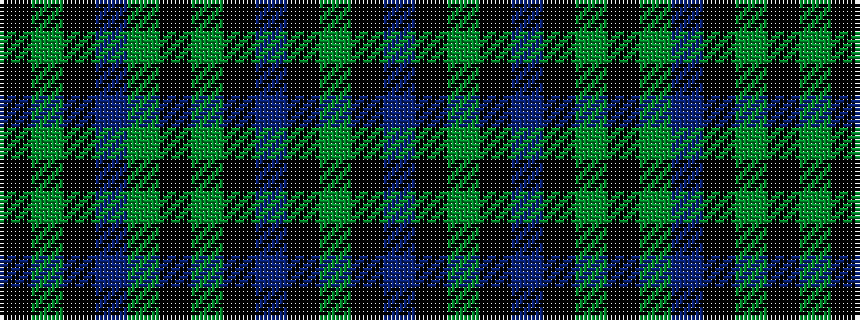

BKGKBKGKGBKGK

It is a 13 stripe tartan.

<figure class="pat-woven">

<figcaption>idealised sample</figcaption>
</figure>

## Colour Sequence



## Tartans with this colour sequence

| Tartans |
|---------------|
| [McCarthy](/setts/s13/k5g1k3dp2g10k3g4k28dp2k2g1k4dp1~x2/)|
||
