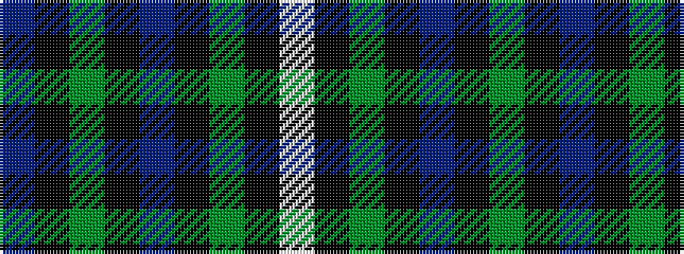

BKGKBKGKW

It is a 9 stripe tartan.

<figure class="pat-woven">

<figcaption>idealised sample</figcaption>
</figure>

## Colour Sequence



## Tartans with this colour sequence

| Tartans |
|---------------|
| [Coffield-Limesand (Personal)](/variants/s9/dp8k1dg2k1do2k6dg8k1w2~x4/)|
||
