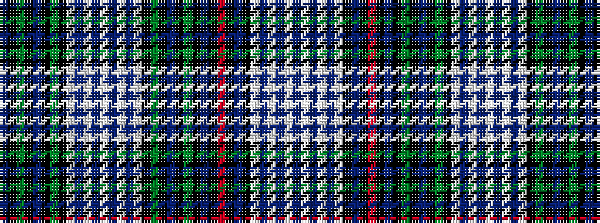

BKGKBKGKWBWBWBWBWKGKBKGKBKRKBKWBWBWB

It is a 36 stripe tartan.

<figure class="pat-woven">

<figcaption>idealised sample</figcaption>
</figure>

## Colour Sequence



## Tartans with this colour sequence

| Tartans |
|---------------|
| [Campbell of Cawdor Dress](/setts/s36/db10k10g10k1db2k1g10k10w2db2w24db2w2db2w24db2w2k10g10k1db2k1g10k10db10k2r3k2db10k10w2db2w24db2w2db2~x2/)|
||
