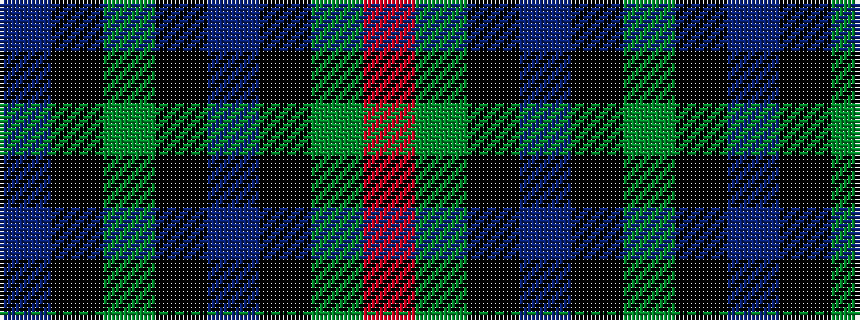

BKGKBKGR

It is a 8 stripe tartan.

<figure class="pat-woven">

<figcaption>idealised sample</figcaption>
</figure>

## Colour Sequence



## Tartans with this colour sequence

| Tartans |
|---------------|
| [AIton - 1979 (Clan)](/setts/s8/db6k1g3k1db3k1g10r3~x2/)|
||
| [Ayrton 1979 No. 2 (Personal)](/setts/s8/b5k1g3k1b3k1g10r3~x2/)|
||
