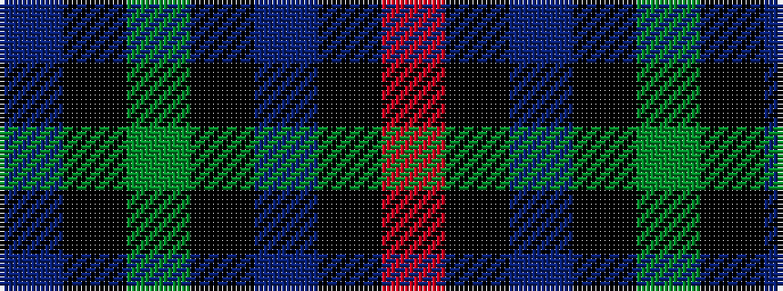

BKGKBKR

It is a 7 stripe tartan.

<figure class="pat-woven">

<figcaption>idealised sample</figcaption>
</figure>

## Colour Sequence



## Tartans with this colour sequence

| Tartans |
|---------------|
| [Argyll](/setts/s7/r2k1db8k8g8k1t2~x2/)|
||
| [Campbell of Cawdor](/setts/s7/r2k1db8k8g8k1t2~x4/)|
||
| [Campbell of Cawdor](/setts/s7/r2k1db8k8dg8k1b2~x2/)|
||
