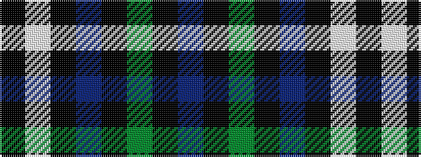

BKGKBKWK

It is a 8 stripe tartan.

<figure class="pat-woven">

<figcaption>idealised sample</figcaption>
</figure>

## Colour Sequence



## Tartans with this colour sequence

| Tartans |
|---------------|
| [Australian Police](/setts/s8/k5w5k5t11k3y17k30t3~x2/)|
||
